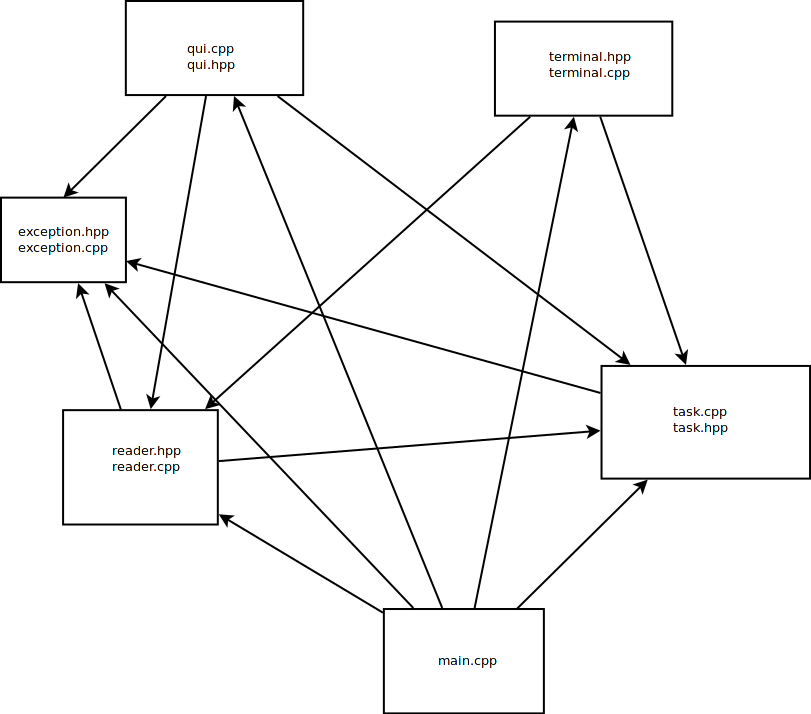

## Úvod
- Aplikace xtodo je napsaná v jazyce c++ a je rozdělena do několika souborů. Všechny hlavičkové soubory mají svoje vlastní zdrojové soubory se stejným názvem, takže po zbytek budu k většině souborů přistupovat jako k hlavičkovém a zdrojovém souboru zároveň.
- Také je většina kódu okomentovaná pomocí standardu [doxygen](https://www.doxygen.nl/index.html) dokumentace.
- Daný projekt je spojován dohromady pomocí [cmake](https://cmake.org/).
- Tato dokumentace je hlavně abstraktní, aby dodala postup jak je projekt rozdělen a strukturován. Pro popis tříd a funkcí využijte dokumentaci vytvořenou pomocí již zmíněného programu doxygen.

### Použité knihovny
- V celém projektu jsou použité standardní knihovny c++ a také grafická knihovna [qt](https://www.qt.io/).

### Jednoduchý diagram závislostí

# Soubory
## `main.cpp`
- Typicky se jedná o hlavní soubor, kde je vstup pro program. Následně se pak vytvoří dané třídy `Tasks` a `Reader`. Přečtou správně argumenty a volá se pak patřičná aplikace. Buď terminálová anebo grafická aplikace.
- Také zde jsou uložené údaje o cestách do souborů a jinde se už předává referencí anebo přímo přes céčkový pointer.

## `reader`
- Soubory `reader.cpp` a `reader.hpp` se starají o čtení a správné parsování argumentů a také čtení (popřípadě i zápis do) souborů.

### `Settings`
- Tahle struktura zachovává údaje o tom jaké nastavení získal daný program pomocí argumentů anebo přečtení dat z konfiguračního souboru.

### `ArgumentReader`
- Tahle třída se stará o čtení argumentů a správné parsování a uložení těchto údajů.
- Také se stará o čtení konfigurančního souboru (pokud není řečeno, že se nemá používat) a uložení tohoto nastavení.
- Nastavení se bere preferenčně z argumentů než z konfiguračního souboru.

### `Reader`
- Poslední třídou v tomhle souboru je pro čtení ze vstupních textových souborů s již uloženými úkoly v daném formátu.
- Také se stará o uložení dat do výstupního souboru.
- Třída jako taková nedrží data o jaké soubory se jedná a kde se nacházejí. Pro každou práci se soubory dostane tyhle údaje přes referenci.

## `task`
- Soubory `task.hpp` a `task.cpp` jsou hlavními soubory pro práci s danými úkoly a zachovávání těchto dat. Jedná se tedy o jádro celé aplikace.
- Také je zde pár podpůrných funkcí.

### Zvlášť funkce
- V tomot soubory jsou funkce pro rozdělení stringu do kontejneru přes speciální character. Také je tu obdobná funkce, která naopak spojuje souvislou podčást kontejneru stringů do jednoho stringu.
- Následně je zde funkce pro konvertování stringu do struktury datumu.

### `Date`
- Datová struktura, která uchovává datum. Neboli tři integery.
- Tato struktura může být i prázdná a to pak znamená, že všechny hodnoty jsou nulové. Potom je zde funkce na dotaz, jestli je datum prázdné.
- Tato struktura má nadefinované operátory pro porovnávání a pro výpis do výstupního streamu (`>` a `>>`).

### `Task`
- Tato třída drží všechny údaje ohledně úkolu.
- Také je určena pro to, aby se s těmito údaji dalo pracovat. Vlastně skoro všechny funkce jsou pro získání dat, nebo změnu dat.
- Je zde také funkce `match` pokud daný úkol obsahuje přidaný podřetězec. To se využívá při hledání úkolů.
- Třída má také nadefinovaný operátor pro porovnávání a pro výpis do streamu (`>` a `>>`).

#### `predTask`
- Protože v `Tasks` se udržují úkoly jako pointery, tak je třeba nadefinovat porovnávání daných pointerů pro třízení úkolů. O to se stará tahle struktua, která funguje jako funktor a má definovaný `operator()`. Pak už se využívá předem definované porovnání úkolů.

### `Tasks`
- Hlavní třída pro držení všech tasků. Dále také dva zásobníku pro funkce `undo` a `redo`. Úkoly jsou uložené v kontejnerů pointerů, aby se na ně dalo ukazovat od jiných míst a data zůstávali na stejném místě v paměti.
- Třída má funkce pro přidávání úkolů (z řetězců) pak tisk úkolů, třízení pomocí předchozího funktoru a taky základní funkce pro kontejner a to `operator[]`, dále možnost získat počet úkolů. Jako jedna změna od normálního kontejneru funkce `at()` nevrátí jen referenci, ale také vytvoří kopii tasku pro možnost `unod` potažmo i `redo`.
- Také je zde iterátor a možnost získat první a poslední iterátor.

#### `Tasks::iterator`
- Třída `Tasks` má i nadefinovaný dopředný iterátor přes `Task`.
- Tato třída má nadefinované jen potřebné funkce pro dopředný iterátor.

### `ChangeTask`
- Jak už bylo zmíněno, tak se během běhu programu vytváří kopie `Task` nicméně to nejsou kopie daných tříd, ale je proto vytvořená speciální třída `Changetask`.
- Tato třída má jen naprosto potřebné data z kopie a ukazatel na daný task. Následně pak má funkci pro `undo` aby se vrátili veškerá data do původního tasku.

## `terminal`
- Tento soubor se stará o celkový běh terminálové aplikace.
- Nevyskutuje se zde už žádná třída, ale jen funkce. Hlavní funkcí pak je `terminalRun`, ve kterém je smyčka, která skončí pokud uživatel tak učiní.

## `qui`
- Soubor pro běh aplikace v grafickém prostředí.
- Jsou zde tři třídy, které jsou ekvivalentní svému danému oknu a tedy i souboru s koncovkou `.ui`.
- `ui` soubory jsou soubory ve tvaru xml se kterými pracuje knihovna `qt`.

### `mainwindow.ui`
- Tohle okno se stará o zobrazení tasků a také menu s možnostmi pro uživatele.
- jako funkce tahle třída má pro zobrazování daných tasků a také sloty pro to co provést po zmáčknutí nějaké možnosti v menu, popřípadě jeho ekvivalent v klávesové zkratce.
- Také se zde barevně zabarvují tasky podle priority. Dané barevné hodnoty v kódu jsou pak víceméně náhodné čísla, tak aby byla všechna čitelná a zároveň se lišila.
- Pokud je nějaký task špatně zadán, tak to uživateli dovolíme, ale upozorníme na to pomocí zvýraznění daného pole.

### `editwindow.ui`
- Jedná se o editační okno, které se zobrazí, pokud se edituje task anebo přidává nový (to se vlastně jedná o editaci prázdného tasku).
- Pokud při editaci došlo k neplatné operaci, tak se okno načte znovu a vypíše hlášku.

### `findwindow.ui`
- Tohle je jen dodatečné malé okno pro vyhledávání v úkolech.

### `MyItem`
- Tahle třída je dědicem od `QListWidgetitem` a vlkádá se do `ListWidget` s úkoly v hlavním okně. Je to převážně proto, aby tahle třída mělo v sobě uložený index daného úkolu.
- Je to protože pokud si uživatel nechá zobrazit jen nějaké tasky, tak index v `ListWidget` se liší od indexu tasku.

## `exception`
- Vlastní soubor pro vyjímky ohledně daného projektu.
- Jsou zde i pár enumeračních typů pro přímo řečení jaká chyba se vyskytla.

### `Exception`
- Hlavní třída pro vyjímku. Je dědicem od `std::exception` a přímo se nepoužívá, ale jen jako předek pro specifické vyjímky.

### `NonExistingItemException`
- Vyjímka jakmile se přistupuje k tasku, který neexistuje.

### `FileProcessingException`
- Pokud se uživatel snaží dát soubor, který nelze použít pro vstup, repsektive pro výstup.

### `NongivenSetting`
- Pokud při inicializaci programu nebylo dodáno dost údajů pro spuštění. Může se jednat o to, že nebyl deklarován interface, nebo jaké soubory používat.

