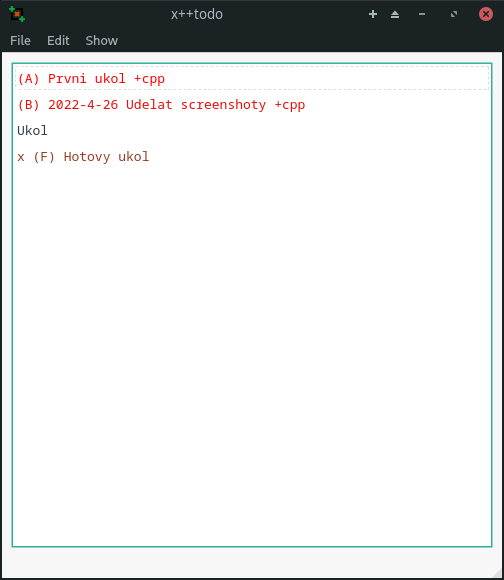
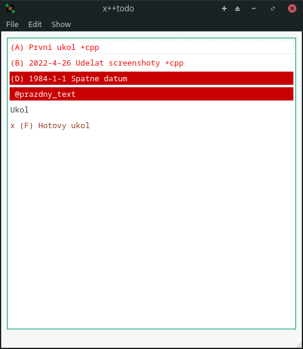
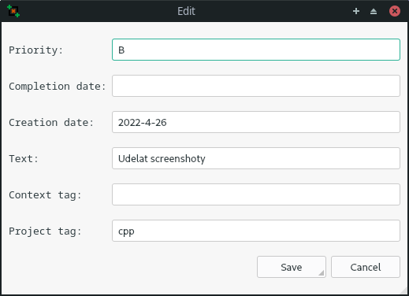

## Úvod
- Aplikaci x++todo je pro organizaci a práci se soubory dle standardu [todo.txt](https://github.com/todotxt/todo.txt). Jediné co není implementované jsou vlastní flagy. Jinak řečeno se jedná o todo aplikaci.

# Build
- Buď lze použít již předem zbuilděné soubory anebo si je poskládat pomocí cmake. *(Není ještě vyzkoušeno na více operačních systémech.)*
<!-- Přidat postup pro build. -->

# Spouštění přes terminál
- Program lze spustit přes volání v terminálu. Potom je vyžadován aby byl již existující textový soubor (již ve formátu todo.txt, anebo prázdný) a také ve stejné složce se spustitelným programem musí být soubor `.config`, který má nastavenou konfiguraci pro spuštění.

## Formát souboru `.config`
- V soubru jsou důležité prakticky jen tři typy řádků.
	1. `FILE=filepath`
		- Může být vícero řádků. Potom musí být nutně specifikován výstupový soubor. Jinak se jako výstupový bere jako jediný vstupní soubor.
	2. `OFILE=filepath`
		- Tato řádka se může objevit maximálně jednou a říká, který soubor je využíván jako výstupový soubor.
	3. `CLIENT=GUI/CLI`
		- Tohle specifikuje pokud se má aplikace spustit v terminálu aneb v grafickém uživatelském rozhraní.
- Formálně jsou komentáře řečené jako řádky začínající `#`.

## Možnosti argumentů při zavolání aplikace
- `-cli`
	- Specifikuje se, že jako rozhraní má být aplikace v terminálu.
- `-gui`
	- Využití grafického rozhraní.
- `-o`
	- Další soubor bude brán jako výstupní soubor.
- `-s`
	- Dané nastavení, které bylo přidáno v argumentech se uloží pro příští použití do souboru `.config`.
- `-noconf`
	- Pro nečtení nastavení z konfiguračního souboru.
- V jiném případě je dané slovo bráno jako soubor (respektive cesta k souboru). Pokud není specifikováno jako výstupní, tak se bere jako vstupní. Jakmile je jen jeden je automaticky brán jako výstupový.

## Běh programu na příkazové řádce
- Po spuštění terminálové aplikace se na řádce objeví `x++:` a za něj se pak volají možné funkce, které daný uživatel chce použít.

### Co lze volat
- `show`
	- Pro zobrazení úkolů, které nejsou označené jako hotové nebo pro smazání. Následně je před každým úkolem napsané jejich číslo pro další funkce.
- `showall`
	- Zobrazí všechny úkoly.
- `edit 1`
	- Pokud je třeba nějaký úkol změnit, tak lze zavolat `edit` a za tím číslo daného úkolu. Pak se otevře speciální dialog.
- `add`
	- Lze použít dvěma způsoby. Buď jen samotně a pak se vytvoří stejný dialog jako pro editaci. Nebo za `add` lze textově napsat daný úkol dle standardu.
- `del`
	- Tohle se volá pro označení (respektive odznačení) úkolů pro smazání úkolu. Pak musí následovat libovolný počet čísel úkolů u kterých se to má změnit.
- `done`
	- Podobně jako u `del` akorát se tentokrát jedná o označení jestli je úkol hotový. Jinak pak úplně stejné.
- `find`
	- Pokud je třeba zobrazit úkoly, které obsahují jako podřetězec něco co je napsané jako další slovo za `find`. Tento podřetěz je brán jako v samotném úkolu nebo kontextu či projektu. Lze i specifikovat pomocí znaků `@` nebo `+` jestli se jedná specificky o kontext nebo projekt.
	- Lze i vypsat úkoly s danou prioritou pokud se specifikuje pomocí `!`. Npaříklad s prioritou A je to `!A`.
- `save`
	- Slouží pro uložení všech úkolů do předem zvoleného výstupního souboru.
- `bye` nebo `exit`
	- Pokud už lze ukončit běh programu s tím, že se vše uloží a tudíž není třeba explicitně psát `save`.
- `quit`
	- Narozdíl od předchozích funkcí neukládá samo o sobě úkoly.
- `sort`
	- Setřídí seznam všech úkolu podle specifika této aplikaci (viz později).
- `undo`
	- Vrátí poslední změnu. Lze volat vícekrát.
- `redo`
	- Vrátí poslední vrácenou změnu. Také lze volat vícekrát.
- `reload`
	- Uloží vše do výstupního souboru a pak ho znovu načte.

### Dialog pro editaci a přidávání nových úkolů
- Jakmile se vyvolá dialog pro editaci (popřípadě pro vytvoření) úkolu, tak se na řádku vždy objeví co se mění následně za dvojtečkou předchozí hodnota a za šipku se píše nová. Pokud chcete zanechat hodnotu, tak stačí jen zmáčknout `Enter` a pokud chcete aby se hodnota smazala, tak doplňte znak `\`.

## Třídění úkolů
- Úkoly lze setřídit pomocí předem definované prioritzace.
- Jako první je pokud je úkol označen pro smazání nebo ne, následuje jestli je úkol již splněn (pokud je splněn nebo označen pro odstranění, tak mají menší prioritu). Následuje už organzace podle samotné priority a jako poslední podle datumů.

## Grafické rozhraní
- Pokud použijete aplikaci v grafickém rozhraní, tak se objeví hlavní okno, kde je vlastně jenom seznam úkolů a menu.

- Potom se aplikace ovládá buď přes volby v menu anebo zmáčknutím adekvátní klávesové zkratky, která je u dané volby napsaná.
- Pokud pracujete s nějakým úkolem, tak je nutné jej předem označit.
- Úkoly jsou taky zabarvené podle priority.
- Pokud daný úkol je v nesprávném tvaru, tak je na červeném poli.
- Pro případné vysvětlení co dělají různé volby v menu, tak jsou vlastně úplně stejné jako u terminálové aplikaci.
- Jsou zde přidané možnosti `open` a `import` s tím, že `opne` uloží momentální soubor a otevře nový. V případě `import` pak jen přečte daný soubor a vloží ho do již vytvořených úkolů.

### Grafický dialog pro editaci
- Pokud chcete úkol editovat nebo přidat nový, tak se otevře nové okno.

- Oprotí terminálové aplikaci se do políček načtou dané data a pak je možné je změnit.
- Pokud je změna neplataná, tak se políčko zabarví červeně a vyzkočí chybová hláška s daným problémem.
